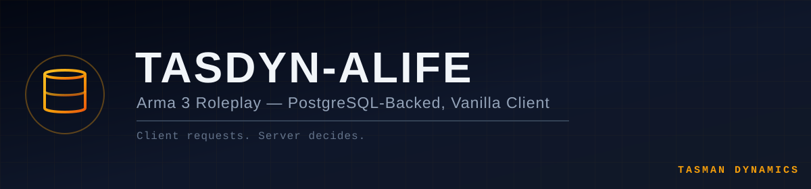

<div align="center">



[](#status)
[-0f172a)](https://arma3.com/)
[](https://www.postgresql.org/)
[](https://discord.gg/Wt4ahmxVrs)

</div>

---

**A Tasman Dynamics Roleplay Server**

TasDyn-ALife is a high-performance Arma 3 Roleplay server for the Oceania/Australia region. Vanilla
client (no mods required), PostgreSQL-backed, built on a custom C++ bridge instead of the
traditional extDB3/MySQL stack. It aims to recreate the "Golden Era" (2014–2017) Arma 3 Life
experience with modern (2025+) server architecture — enterprise-grade data handling,
server-authoritative game logic, and heuristic anti-cheat, without requiring players to install any
client-side mods.

---

## Status

This project is in the **concept / architecture design phase**. An earlier prototype explored this idea end-to-end and surfaced real lessons about the save/load data contract, schema discipline, and repo hygiene — this repo is a deliberate clean start that applies those lessons rather than carrying the old code forward. Expect the structure below to fill in incrementally, tracked through PRs and the roadmap.

**Target public launch: 2026-12-26.** See [docs/ROADMAP.md](docs/ROADMAP.md) for the phased plan,
timeline, and what's deliberately cut from the launch scope. Day-to-day progress is tracked as
issues on the [Delivery Board](https://github.com/orgs/A3-TasmanDynamics/projects/1).

---

## 1. Concept

Unlike traditional vanilla servers that rely on slow SQF-based MySQL bridges (extDB3), ALife uses a **custom C++ extension** to bridge Arma 3 directly to **PostgreSQL**. This allows for enterprise-grade data handling, complex math offloading (anti-cheat), and future web integration without server-side lag.

**Design philosophy:** *"Client Requests, Server Decides."* The client never trusts itself — it sends an intent (e.g. "Request Buy Item"), the server validates against the database, mutates state, and tells the client the outcome.

---

## 2. Technical Stack & Architecture

### Backend (the "Engine")
* **Database:** PostgreSQL 16+
  * Superior JSONB handling for inventory, stricter data types, enterprise reliability.
* **Bridge:** Custom C++ extension (Windows DLL, `RVExtension`/`RVExtensionArgs`)
  * Handles database I/O via `libpqxx` with **prepared statements only** — no hand-built SQL strings.
  * Offloads heavy calculation (anti-cheat distance checks, economy balancing) out of SQF.

### Frontend (Web & Admin) — planned
* **Dashboard:** NuxtJS (TypeScript) — ticket system, gang management, player stats, live RCON graphs.
* **Discord Integration:** Node.js bot, two-way synced with Postgres (in-game tickets → Discord alerts).

### Game Logic (SQF)
* Custom framework, built for this project rather than adapted from an existing base.
* All persistence-relevant state (rank, money, inventory) flows through one documented client/server array contract — the previous prototype's biggest lesson was that positional SQF↔C++ array formats drift silently when they aren't specified in one place. That contract will be written down before any save/load code is, not after.

---

## 3. Gameplay Concept

### Factions
1. **West (Police — APF):** Highway/general duties/SOG vehicle tiers, placeables (cones/barriers), speed cameras, physical jail.
2. **Independent (Medics — AMS):** Ground and air ambulance, advanced revive (defib + timer).
3. **Civilian:** Standard legal jobs (mining, trucking, fishing) plus a gated "Rebel" sub-faction unlocking weapons and cartel hideouts.

### Economy
AUD currency, dynamic supply/demand market, physical cash vs. digital bank, resource-gated activities (e.g. uranium mining).

### Anti-Cheat (heuristic, server-side)
Since client memory can't be scanned on a vanilla client:
* Honeypot variables to trap variable scanners.
* Server-side movement validation (distance-per-tick) to flag teleportation.
* Transaction locking during DB writes to prevent duplication exploits.

### Visual Identity (vanilla workarounds)
`setObjectTextureGlobal` texture injection for faction liveries and rank-based uniforms — no custom mod required client-side.

---

## 4. Project Structure

```text
TasDyn-ALife/
├── .github/workflows/   # Delivery-board sync (org-standard CI)
├── database/            # PostgreSQL schema (single source of truth — see database/README.md)
├── src/
│   ├── cpp_extension/   # C++ bridge (the DB extension DLL)
│   ├── mission/         # SQF mission source
│   ├── web_dashboard/   # NuxtJS admin panel (planned)
│   └── discord_bot/     # Node.js bot (planned)
├── docs/                # Design docs (data contracts, architecture decisions)
│   └── assets/          # Banner and brand assets
└── server_dist/         # Local server deploy target — git-ignored, never committed
```

---

## 5. Contributing

See [CONTRIBUTING.md](CONTRIBUTING.md) for branching, PR, and data-contract conventions. In short:

* Work happens on feature branches, merged via pull request — nothing is pushed directly to `main`.
* Never commit real credentials. Copy `config.ini.example` to `config.ini` locally; `config.ini` is git-ignored.
* Never commit build output (`build/`, `*.dll`, `*.pbo`) or the `server_dist/` deploy tree — see [.gitignore](.gitignore).

---

## 6. License

Proprietary — © Tasman Dynamics. All rights reserved. Source is public for transparency; no reuse, redistribution, or derivative works without written permission.

---

<div align="center">

Questions about the project? [Join the Tasman Dynamics Discord](https://discord.gg/Wt4ahmxVrs).

</div>
